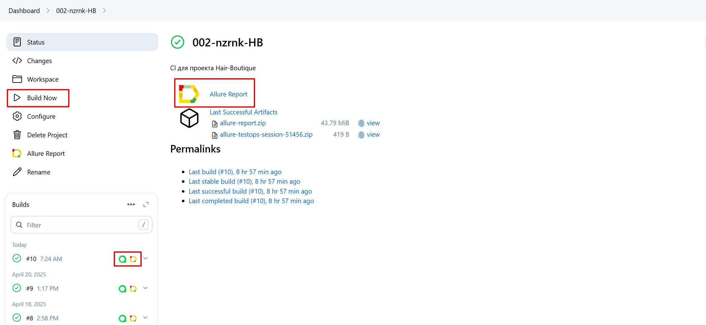
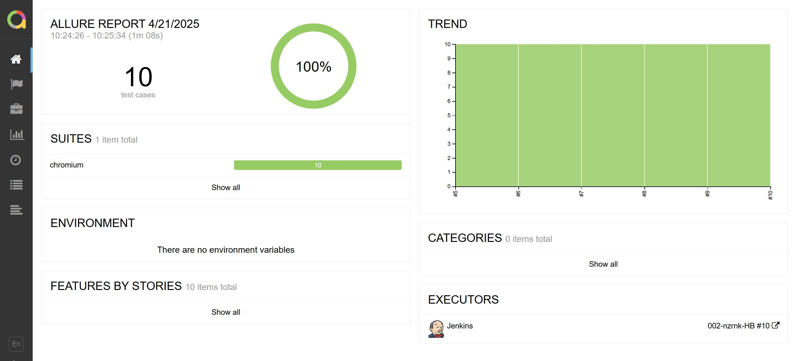
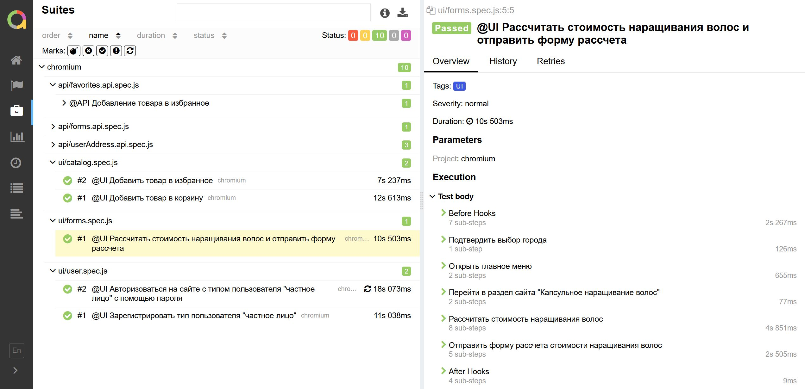
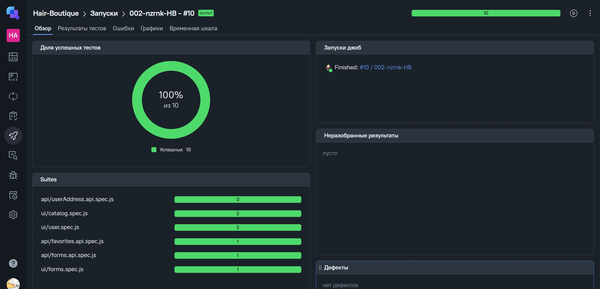
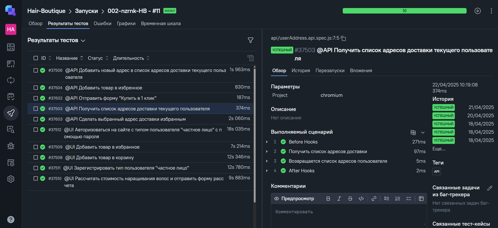
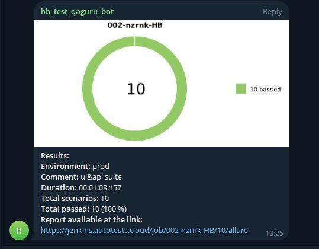

## Проект автоматизации тестирования для сайта hair-boutique
---
## Содержание
- [Описание](#Описание)
- [Стек](#Стек)
- [Тест-кейсы](#Тест-кейсы)
- [Запуск тестов и генерация отчетов](#Запуск-тестов-и-генерация-отчетов)
- [Запуск пайплайна автотестов в Jenkins](#Запуск-пайплайна-автотестов-в-Jenkins)
- [Пример Allure-отчета](#Пример-Allure-отчета)
- [Пример интеграции с ТестОпс](№Пример-интеграции-с-ТестОпс)
- [Уведомление в Telegram](#Уведомление-в-Telegram)

---
## Описание

Данный репозиторий демонстрирует пример автоматизации тестирования для проекта [Hair-Boutique.com](https://hair-boutique.ru/). Сайт относится к категории e-commerce (b2c) и является интернет-магазином для продажи искусственных волос, товаров и аксессуаров к ним, a так же оказанию различного вида услуг, связанных с данной областью.

---
## Стек
<div align="center">
  
  
  
  
  
  
  
</div>

Репозиторий содержит в себе набор UI и API тестов, напиcанных на JavaScript c использованием фреймворка автоматизации Playwright. Настроен Jenkins как CI-система: реализован запуск автотестов, генерация Allure-отчетов, интеграция с ТестОпс и отправка уведомлений в Telegram.

---
## Тест-кейсы
- UI
  - Добавить товар в корзину
  - Добавить товар в избранное
  - Рассчитать стоимость наращивания волос и отправить форму расчета
  - Зарегистрировать тип пользователя "частное лицо"
  - Авторизоваться на сайте с типом пользователя "частное лицо" c помощью пароля
- API
  - Добавить товар в избранное
  - Отправить форму "Купить в 1 клик"
  - Получить список адресов доставки текущего пользователя
  - Добавить новый адрес в список адресов доставки текущего пользователя
  - Сделать выбранный адрес доставки избранным
---
## Запуск тестов и генерация отчетов

Команда для локального запуска всех тестов
```
npm run allTests 
```
Команда для локального запуска UI тестов
```
npm run uiTests
```
Команда для локального запуска API тестов
```
npm run apiTests
```

Команда для локального формирования отчета

```
npm run create-report
npm run open-report
```
---
## Запуск пайплайна автотестов в [Jenkins](https://jenkins.autotests.cloud/job/002-nzrnk-HB/)

Для запуска пайплайна необходимо авторизоваться на сайте [Jenkins](https://jenkins.autotests.cloud/login?from=%2F), перейти в соответствующую [джобу](https://jenkins.autotests.cloud/job/002-nzrnk-HB/) и нажать Build Now. После завершения сборки будет сформирован Allure-отчет, результаты сборки будут отправлены в ТестОпс, а так же в Telegram. В разделе Builds напротив номера сборки появятся иконки Allure (cсылка на Allure-отчет так же есть на основной странице) и ТестОпс, перейдя по которым можно посмотреть результаты сборки.



---
## Пример [Allure-отчета](https://jenkins.autotests.cloud/job/002-nzrnk-HB/allure/)



---
## Пример интеграции с [ТестОпс](https://allure.autotests.cloud/project/4716/test-cases?treeId=0)



---
## Уведомление в Telegram
<div align="center">

</div>
